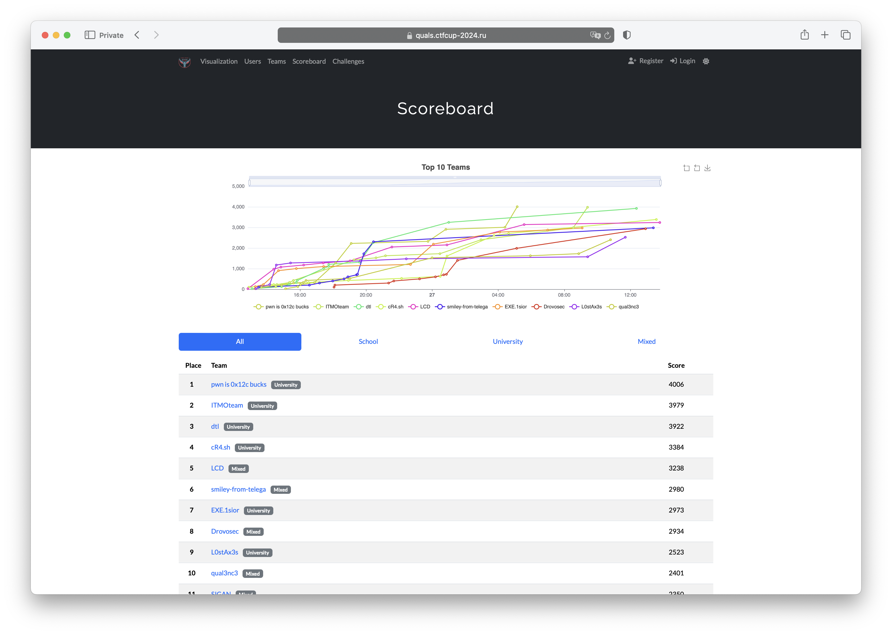

# Отборочный этап VIII Кубка CTF России
Исходные коды, разборы, сплоиты и файлы для деплоя заданий с отборочного тура VIII Кубка CTF России, который проходил 26-27 октября 2024 года онлайн. Задания разрабатывала команда [C4T BuT S4D](https://github.com/C4T-BuT-S4D).

[Сайт соревнования](https://ctfcup.ru/)

- Организаторы: **АРСИБ** и **ВОД «Наставники России»**
- Генеральный партнер: **AQUARIUS**
- Официальные партнеры: **Сбер** и **Газпромбанк**

# Результаты

[Весь скорборд](screenshots/full-all.png)

# Информация
- Руководитель проекта: [@deviantwish](https://github.com/deviantwish)
- Технический директор: Максим Смирнов
- Тимлид: [@falamous](https://github.com/falamous)
- DevOps: [@pomo-mondreganto](https://github.com/pomo-mondreganto)

# Задания
| Название | Категория | Автор|
|------|-----------|-------|
| [ALODISPETCHER](tasks/crypto/easy-ALODISPETCHER) | crypto | [uvicorn](https://github.com/uvicorn) |
| [likvidirovan](tasks/crypto/medium-likvidirovan) | crypto | [uvicorn](https://github.com/uvicorn) |
| [Annihilatornaya pushka](tasks/crypto/hard-annihilatornai_pushka) | crypto | [uvicorn](https://github.com/uvicorn) |
| [Neat](tasks/misc/easy-neat) | misc | [@qumusabel](https://github.com/qumusabel) |
| [Loooooooong graph](tasks/misc/medium-long-graph) | misc | [@falamous](https://github.com/falamous) |
| [just bfs](tasks/misc/hard-just-bfs) | misc | [@falamous](https://github.com/falamous) |
| [pointless](tasks/pwn/easy-pointless) | pwn | [@falamous](https://github.com/falamous) |
| [olymp](tasks/pwn/medium-olymp) | pwn | [@falamous](https://github.com/falamous) |
| [R4v5h4n N Dj4m5hu7](tasks/pwn/hard-R4v5h4n-N-Dj4m5hu7) | pwn | [@falamous](https://github.com/falamous) |
| [searcher](tasks/reverse/easy-searcher) | reverse | [@falamous](https://github.com/falamous) |
| [strange rootkit](tasks/reverse/medium-strange-rootkit) | reverse | [@falamous](https://github.com/falamous) |
| [weird crypter](tasks/reverse/hard-weird-crypter) | reverse | [@falamous](https://github.com/falamous) |
| [etcstore](tasks/web/easy-etcstore) | web | [@jnovikov](https://github.com/jnovikov) |
| [etcstore-revenge](tasks/web/easy-etcstore-revenge) | web | [@jnovikov](https://github.com/jnovikov) |
| [konstruktor](tasks/web/medium-konstruktor) | web | [@jnovikov](https://github.com/jnovikov) |
| [hackerchat](tasks/web/hard-hackerchat) | web | [@asokol123](https://github.com/asokol123) |
